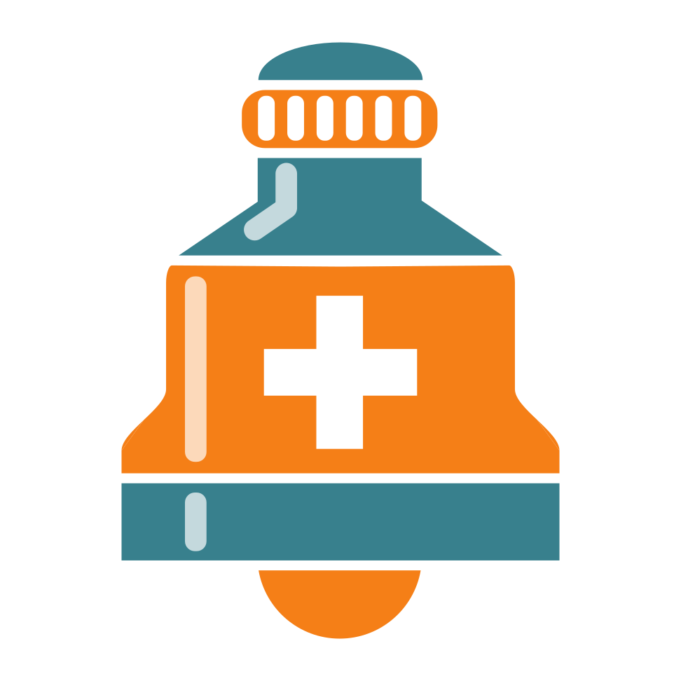

# 💊 Remedmind

<div align="center">
  
  
  **Your Personal Medication Reminder Assistant**
  
  [](https://www.apple.com/ios/)
  [](https://swift.org)
  [](LICENSE)
  
  *Never miss a medication dose again*
</div>

---

## 📱 About

Remedmind is a comprehensive iOS medication reminder application that helps you track your medicine intake schedules, manage medication supplies, and receive timely notifications. Built with SwiftUI and featuring CloudKit sync, your medication data stays with you across all your Apple devices.

## ✨ Features

### 🎯 Medication Management
- **18 Medication Types Supported**: Capsules, tablets, liquids, injections, inhalers, patches, and more
- **Detailed Information**: Track brand names, descriptions, and personal notes for each medication
- **Visual Icons**: Custom icons for easy medication identification

### ⏰ Flexible Scheduling
- **Multiple Frequencies**: Daily, every other day, or weekly schedules
- **Custom Days**: Select specific days of the week for medication intake
- **Multiple Doses**: Configure multiple administrations per day
- **Date Ranges**: Set start and optional end dates for treatments

### 🔔 Smart Notifications
- **Administration Reminders**: Get notified at the right time for each dose
- **Two Notification Modes**:
  - **Automatic**: Evenly distributed notifications throughout the day
  - **Custom**: Set your own preferred times
- **Package Alerts**: Receive warnings when running low on medication
- **7-Day Scheduling**: Notifications created a week in advance

### 📊 Intake Tracking
- **Visual Progress**: See your daily intake progress at a glance
- **Historical Records**: Track your medication adherence over time
- **Automatic Backfilling**: Missing intake records are automatically created
- **Calendar Integration**: Intuitive date-based navigation

### 📦 Package Management
- **Quantity Tracking**: Monitor remaining doses in your current package
- **Smart Predictions**: Algorithm calculates when you'll run out
- **Exhaustion Alerts**: Get notified before your medication runs out

### 🎨 Customization
- **4 Beautiful Themes**: Default, Dark Cyan, Princeton Orange, and Monochrome
- **8 Alternate Icons**: Multiple color schemes in light and dark variants
- **Appearance Modes**: System, Light, or Dark mode support
- **Persistent Settings**: All preferences saved across app launches

## 🏗️ Technical Details

### Built With
- **SwiftUI** - Modern declarative UI framework
- **CoreData** - Local data persistence
- **CloudKit** - Cross-device synchronization
- **UserNotifications** - Smart notification scheduling

### Architecture
- MVVM-inspired design pattern
- Environment Objects for state management
- Protocol-oriented programming
- Extensive use of Swift extensions for code organization

### Data Model
- **Reminder Entity**: Comprehensive medication information and settings
- **DailyIntake Entity**: Daily intake tracking and progress

## 🌍 Localization

Fully localized in:
- 🇬🇧 English
- 🇮🇹 Italian

All date, time, and calendar formats are properly localized.

## 🔒 Privacy

**We respect your privacy.** Remedmind:
- ✅ Does NOT collect any personal data
- ✅ Does NOT track usage analytics
- ✅ Stores all data locally on your device
- ✅ CloudKit sync is optional and user-controlled
- ✅ No third-party services or advertisements

## 🚀 Installation

### Requirements
- iOS 15.0 or later
- Xcode 14.0 or later (for building from source)

### From Source
```bash
git clone https://github.com/Light2288/remedmind.git
cd remedmind
open Remedmind.xcodeproj
